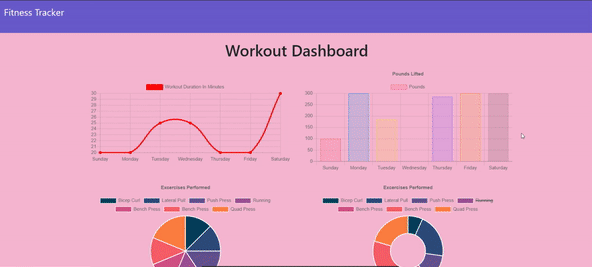

# Fitness-Tracker

**To see this site live on Heroku, click [here](https://natalie-fitness.herokuapp.com/).**

## **Table of Contents**

* Project Description
* Assignment Instructions
* Assignment Requirements
* Project Objective
* Usage
* Licence
* Contributors
* Installation
* Tests
* Video of Deployed Application

## ❔ **Description**

This application tracks a user's workouts.

## 💡 **Assignment Instructions**

You have already been provided with the front end code in the `Develop` folder. 

This assignment will require you to create Mongo database with a Mongoose schema and handle routes with Express.

## 📌 **Assignment Requirements**

- [x] When the user loads the page, they should be given the option to create a new workout, or continue with their last workout.

The user should be able to:

  - [x] Add exercises to a previous workout plan.

  - [x] Add new exercises to a new workout plan.

  - [x] View multiple the combined weight of multiple exercises on the `stats` page.

## 🔲 **Objective**

- [x] Create a functioning workout tracker.

## 🔑 **Usage**

A consumer will reach their fitness goals quicker when they track their workout progress.

## © **Licence**

MIT License. See LICENSE file for more information.

## 💬 **Contributors**

This was a solo project for a UofU Coding Bootcamp, but credit must also be noted for my instructor and TA's, as well as the author of our class curriculum and our SSM. 

## 🔒 **Installation**

Run npm i and npm i seed in your terminal. 

Feel free to clone this repo at your leisure. 

## 📂 **Tests**

There are currently no tests for this app. 

## **Video of Deployed Application**

